# ESP32-CC1101-Transmission

<div align="center">

</div>

## Introduction

This project's primary goal is to demonstrate how to transmit a signal using the CC1101 transceiver with the ESP-IDF framework. We will also explore how to interpret and navigate long technical datasheets, particularly those for RF devices. This guide is intended for readers who are looking to get started writing firmware for any embedded device.

Reading [my previous writeup](https://github.com/ryan2625/ESP32-CC1101/tree/main?tab=readme-ov-file#esp32-cc1101) first will be very helpful when following this guide. In that writeup, I discuss the software and hardware prerequisites, as well as explain fundamental concepts about embedded devices. It also shows the more rudimentary task of reading a status register inside of the CC1101. 

It is far more complex to transmit a radio signal with our device and the theory can be difficult to understand, so ensure you are comfortable with the topics in that guide before proceeding.

In addition to the steps [outlined in my first guide](https://github.com/ryan2625/ESP32-CC1101#steps), transmitting a signal with the CC1101 requires multiple stages:

- Setting the carrier frequency (i.e. 315 MHz)
- Configuring the modulation format (AM, FM, etc)
- Specifying the data rate
- Setting the power level of your radio
- Understanding how to format the data you want to transmit
- Transmitting that data in C++ with ESP-IDF

We will go through exactly how to accomplish each of these steps with examples from the datasheet.

This README will heavily reference the official **[TI CC1101 transceiver datasheet](https://www.ti.com/lit/ds/symlink/cc1101.pdf)** as well as parts of the [ESP32 documentation](https://docs.espressif.com/projects/esp-idf/en/stable/esp32/api-reference/peripherals/spi_master.html). This particular repository uses the [PlatformIO IDE extension for VSCode](https://platformio.org/install/ide?install=vscode), but using the ESP-IDF extension for VSCode is also viable. 


## Table of Contents

1. [Important Concepts](#1-important-concepts)
   - [Carrier Frequency](#carrier-frequency)
   - [Register Values](#register-values)
   - [Radio States](#radio-states)
   - [Navigating the Datasheet](#navigating-the-datasheet)
2. [Frequency Programming](#2-frequency-programming)
    - [Frequency Overview](#section-21-frequency-programming-overview)
    - [Calculating the Frequency](#calculating-the-frequency)
3. [Modulation Format](#3-modulation-format)  
   - [Modulation Overview](#section-16-modulation-formats-overview)  
   - [Scientific Notation](#scientific-notation)
   - [Calculating the Frequency Deviation](#calculating-the-frequency-deviation)
4. [Bit Timing and Data Rate](#4-bit-timing-and-data-rate)  
   - [Data Rate Overview](#section-12-data-rate-programming-overview)  
   - [Calculating the Data Rate](#calculating-the-data-rate)
5. [Transmit Power](#5-transmit-power)  
   - [Power Overview](#section-24-output-power-programming-overview)  
   - [Setting the Output Power](#setting-the-output-power)
6. [Transmitting Packets](#6-transmitting-packets)
   - [Packet Structure](#packet-structure)  
   - [Transmission Mechanics and the Data FIFO](#transmission-mechanics-and-the-data-fifo) 
   - [TX FIFO Threshold](#tx-fifo-threshold)
7. [Sending Data in C++](#7-sending-data-in-c)
   - [Configuring the SPI Bus](#configuring-the-spi-bus)  
   - [Helper Functions](#helper-functions)
   - [Configuring Registers](#configuring-registers)
8. [Running the Program](#8-running-the-program)  
   - [Proving the Transmission Was Successful](#proving-the-transmission-was-successful)
9. [Datasheet and Theory Abstraction in Libraries](#9-datasheet-and-theory-abstraction-in-libraries)

# 1. Important Concepts
## Carrier Frequency
The CC1101 uses what is known as a 'Carrier Frequency' to transmit data. The carrier frequency itself is just a sine wave, and properties of this wave are modulated to encode information. Common modulation techniques include FM and AM. FM (frequency modulation) works by shifting the frequency slightly while AM (amplitude modulation) works by varying the height of the wave to represent data.

> Example: 2-FSK, which is a type of FM modulation, works by shifting between specific frequencies to represent bits. The amount the frequency shifts by is called the 'deviation.' If we are transmitting a 315 MHz signal, we might use a deviation of 25 kHz and send 314.975 MHz to signify a `0` bit and 315.025 MHz to signify a `1` bit.

<div align="center">

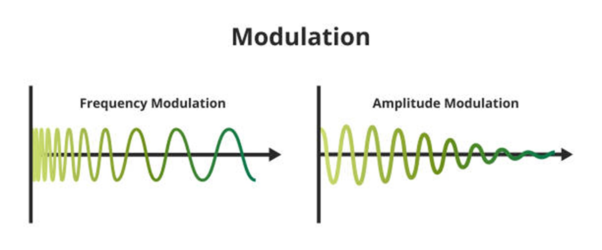

Visual Representation of AM and FM

</div>

## Register Values
A 'register' inside of the CC1101 is an addressable location that contains a byte of data relating to [configuration settings, status information, or command strobes](https://github.com/ryan2625/ESP32-CC1101?tab=readme-ov-file#spi-accessible-types). Some registers are dedicated to containing only a single field. One example of this is the `RSSI` register, which uses all 8 bits to hold the signal strength information. 

Alternatively, some registers have unused bits or may contain multiple fields. In these cases, since multiple fields share the same register, **we must modify only the relevant bits while leaving the others unchanged**. 

Using the `FOCCFG` register as an example, suppose we want to set the `FOC_PRE_K` field to `11`. The default bits in this register shown by the 'Reset' column are `0011 0110`. 
<br>

<div align="center">

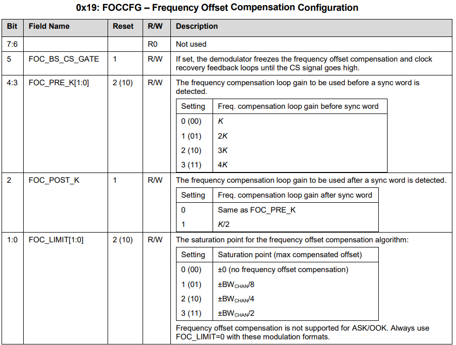

 Page 83: `FOCCFG` Register

</div>
<br>

To preserve all other default values while only updating the `FOC_PRE_K` field, the resulting byte we send will be `0011 1110` (or `0x3E` in hexadecimal). The table below shows the exact bit changes when we update this register.
<div align="center">

| Bits | Field             | Default | New Value |
|------|-------------------|--------|----------|
| 7:6  | Not used          | `00`     | `00`       |
| 5    | FOC_BS_CS_GATE    | `1`      | `1`        |
| 4:3  | FOC_PRE_K[1:0]    | `10`     | **`11`**   |
| 2    | FOC_POST_K        | `1`      | `1`        |
| 1:0  | FOC_LIMIT[1:0]    | `10`     | `10`       |

</div>

>Note: An online [binary to hex calculator](https://www.rapidtables.com/convert/number/binary-to-hex.html) can be helpful for converting register values.

## Radio States
The concept of a 'radio state' in the CC1101 refers to the device's ability to exist and switch between different operational modes. Essentially, the CC1101 can only perform specific actions like transmitting a signal if it is in the correct radio state.

Pictured below is the simplified Radio Control State diagram. It is not necessary to understand every part of the diagram, but it is helpful to understand the general concept. The [full diagram](#entire_radio) can be found on page 50 of the datasheet. 

One way to think about radio states is to imagine starting up your car. You can’t just press the start button at any time. It has to be in the correct “state” first, such as being in Park with your foot on the brake. Only when those conditions are met does the “start engine” action work.

In the same way, the CC1101 radio can only perform certain actions when it is in the correct internal state.

<div align="center">
   
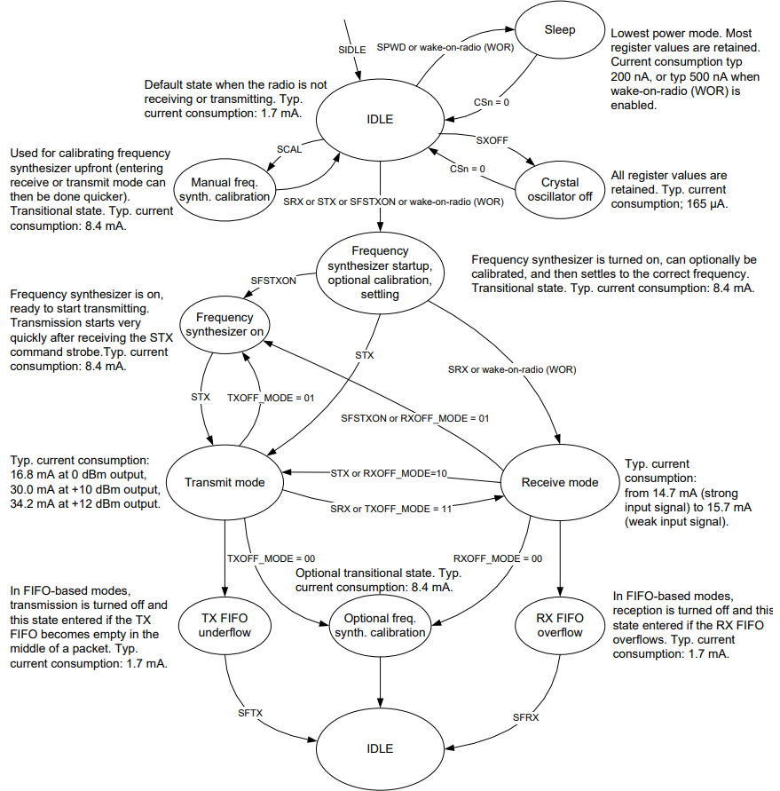

Page 28: Simplified Radio Control Diagram

</div>

> [!NOTE]
> For example, the radio cannot enter the `TXFIFO_UNDERFLOW` state if it is in the `IDLE` state. It must first move through the required
> intermediate states like frequency synthesizer calibration and transmit mode.

## Navigating the Datasheet
The CC1101 datasheet is around 100 pages long and contains many diagrams, equations, and tables detailing various properties of the device. If you have never worked with a datasheet before, it can be difficult to know where to begin. To approach this, we will work backwards from our goal of transmitting a signal with the CC1101 and think about what properties we need to configure in order to achieve this.

 **Section 8: Configuration Overview** gives a holistic account of the radio's different functions and will be helpful in guiding our intuition. We can separate the datasheet sections into three different categories.

1. The first category includes sections regarding general configuration. This includes how we can communicate with the CC1101, any specific power-on sequence the device requires, and other basic setup details.

2. The second category includes sections regarding configuring the parameters of the signal we transmit. This includes the frequency, modulation technique, data rate, and radio power level.

3. The third category includes sections that may be helpful for transmitting a signal, but are not strictly necessary. Any sections related to receiving signals will be ignored, since we are focusing solely on transmission.

With this mental map, let's analyze the datasheet and find the relevant sections. You will notice many of the earlier sections in the datasheet relate to the physical hardware specifications. This includes **Section 1** (absolute maximum ratings), **Section 2** (operating conditions), and so on. Many of these are not directly relevant to the goal of this project and can largely be ignored.

<details>
<summary><strong>CC1101 Datasheet Table of Contents</strong></summary>
<pre>
1. Absolute Maximum Ratings
2. Operating Conditions
3. General Characteristics
4. Electrical Specifications
  4.1 Current Consumption
  4.2 RF Receive Section
  4.3 RF Transmit Section
  4.4 Crystal Oscillator
  4.5 Low Power RC Oscillator
  4.6 Frequency Synthesizer Characteristics
  4.7 Analog Temperature Sensor
  4.8 DC Characteristics
  4.9 Power-On Reset
5. Pin Configuration
6. Circuit Description
7. Application Circuit
  7.1 Bias Resistor
  7.2 Balun and RF Matching
  7.3 Crystal
  7.4 Reference Signal
  7.5 Additional Filtering
  7.6 Power Supply Decoupling
  7.7 Antenna Considerations
  7.8 PCB Layout Recommendations
8. Configuration Overview
9. Configuration Software
10. 4-Wire Serial Configuration and Data Interface
  10.1 Chip Status Byte
  10.2 Register Access
  10.3 SPI Read
  10.4 Command Strobes
  10.5 FIFO Access
  10.6 PATABLE Access
11. Microcontroller Interface and Pin Configuration
  11.1 Configuration Interface
  11.2 General Control and Status Pins
  11.3 Optional Radio Control Feature
12. Data Rate Programming
13. Receiver Channel Filter Bandwidth
14. Demodulator, Symbol Synchronizer, and Data Decision
  14.1 Frequency Offset Compensation
  14.2 Bit Synchronization
  14.3 Byte Synchronization
15. Packet Handling Hardware Support
  15.1 Data Whitening
  15.2 Packet Format
  15.3 Packet Filtering in Receive Mode
  15.4 Packet Handling in Transmit Mode
  15.5 Packet Handling in Receive Mode
  15.6 Packet Handling in Firmware
16. Modulation Formats
  16.1 Frequency Shift Keying
  16.2 Minimum Shift Keying
  16.3 Amplitude Modulation
17. Received Signal Qualifiers and Link Quality Information
  17.1 Sync Word Qualifier
  17.2 Preamble Quality Threshold (PQT)
  17.3 RSSI
  17.4 Carrier Sense (CS)
  17.5 Clear Channel Assessment (CCA)
  17.6 Link Quality Indicator (LQI)
18. Forward Error Correction with Interleaving
  18.1 Forward Error Correction (FEC)
  18.2 Interleaving
19. Radio Control
  19.1 Power-On Start-Up Sequence
  19.2 Crystal Control
  19.3 Voltage Regulator Control
  19.4 Active Modes (RX and TX)
  19.5 Wake On Radio (WOR)
  19.6 Timing
  19.7 RX Termination Timer
20. Data FIFO
21. Frequency Programming
22. VCO
  22.1 VCO and PLL Self-Calibration
23. Voltage Regulators
24. Output Power Programming
25. Shaping and PA Ramping
26. General Purpose / Test Output Control Pins
27. Asynchronous and Synchronous Serial Operation
  27.1 Asynchronous Serial Operation
  27.2 Synchronous Serial Operation
28. System Considerations and Guidelines
  28.1 SRD Regulations
  28.2 Frequency Hopping and Multi-Channel Systems
  28.3 Wideband Modulation When Not Using Spread Spectrum
  28.4 Wireless M-Bus
  28.5 Data Burst Transmissions
  28.6 Continuous Transmissions
  28.7 Battery Operated Systems
  28.8 Increasing Range
29. Configuration Registers
  29.1 Registers Preserved in Sleep State
  29.2 Registers That Lose Programming in Sleep State
  29.3 Status Register Details
30. Soldering Information
31. Development Kit Ordering Information
32. References
33. General Information
  33.1 Document History
</pre>
</details>


### General Configuration Sections
Whenever we are writing firmware for an embedded device, we need to know how to communicate with the system and if there are any peculiar setup details.
[My first writeup](https://github.com/ryan2625/ESP32-CC1101/tree/main?tab=readme-ov-file#esp32-cc1101) for the CC1101 described some of the sections about general configuration already, but we will briefly revisit them below.

- **Section 10: 4-Wire Serial Configuration and Data Interface** - This section tells us the protocol to use when communicating with the chip ([SPI](https://www.analog.com/en/resources/analog-dialogue/articles/introduction-to-spi-interface.html)) and how to access registers in the CC1101. This is one of the first and most important sections to understand when writing firmware for this chip, as everything after this point builds off of this section.

- **Section 29: Configuration Registers** - Here we will find the addresses for all of the registers in the radio. These include status registers as well as configuration registers that hold our radio's signal parameters. Each section in the datasheet lists its relevant registers, so **Section 29** will be referenced frequently.

- **Section 19: Radio Control** - Describes important setup details and how the radio operates internally through state transitions. **Section 19.0** shows us the state control diagram, while **Section 19.1** tells us the exact sequence the device expects when it powers on.

---

### Signal Configuration Sections
Every radio transmission has specific parameters that must be configured, regardless of the device being used. These common parameters are the frequency, modulation type, data rate, and transmit power. Technically, the CC1101 has values for many of these in its registers by default, but they're not exactly useful if we want to transmit a custom signal. Therefore, we will configure these parameters manually. 

<div align='center'>

| Parameter | Purpose |
|----------|---------|
| Carrier frequency | Determines where in the RF spectrum we transmit |
| Modulation format | Determines how data is encoded onto the frequency |
| Data rate | Determines how fast bits are transmitted |
| Transmit power | Determines signal strength and range |
</div>


- **Section 21: Frequency Programming** - Provides the relevant equations and registers for setting up the frequency the CC1101 will transmit at. You will also find information about setting up different frequency channels, where you can switch between multiple frequencies quickly (such as 315 MHz, 433 MHz, and 915 MHz).

- **Section 16: Modulation Formats** - Talks about the different types of modulation formats the CC1101 is capable of implementing

- **Section 12: Data Rate Programming** - Discusses how to calculate and configure the data rate, which is how fast we send bits with our radio. 

- **Section 24: Output Power Programming** - Details the relevant registers for setting the output power of the radio. 

- **Section 15: Packet Handling Hardware Support** and **Section 20: Data FIFO** - These sections don't define explicit parameters about the signal, but rather how we will structure and send data with the signal.
---

### Optional Sections
- **Section 8: Configuration Overview** - Description of different CC1101 parameters and capabilities.
- **Section 9: Configuration Software** - Suggestions on software to assist in calculating register values. This guide will not be using the recommended configuration software (SmartRF Studio); rather, we will be solving the datasheet equations by hand.
- **Section 14: Demodulator, Symbol Synchronizer, and Data Decision** - Offers context for how the CC1101 handles packets. 
- **Section 18: Forward Error Correction with Interleaving** - Describes optional error correction techniques used to improve reliability during transmission. We will not be investigating this section in this guide.

# 2. Frequency Programming
## **Section 21: Frequency Programming** Overview
Frequency programming in the CC1101 is a channel-oriented system. This means that you can store multiple frequencies inside registers and switch between them instantaneously. In this guide, we will only be configuring one frequency, so the parts in the datasheet regarding the `MDMCFG0.CHANSPC_M`, `MDMCFG1.CHANSPC_E`, `FSCTRL1.FREQ_IF`, and `CHANNR.CHAN` channel fields can be ignored for simplicity. 

Note that parameters such as the frequency can only be changed while the radio is in the `IDLE` state.

The frequency is stored as a 24-bit word split across three registers containing 1 byte each: `FREQ2`, `FREQ1`, and `FREQ0`. Table 45 shows the  addresses to each register (`0x0D`, `0x0E`, and `0x0F` respectively).

> [!IMPORTANT]
> This 24 bit word is not representing a frequency such as 315 MHz. Rather, it is a value the CC1101 will use to derive the frequency using its equations. Also, a 'word' in this context simply means a collection of bits.

<div align="center">

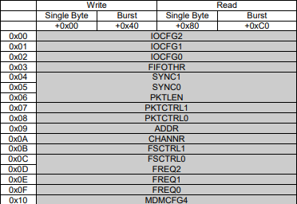

Table 45: SPI Address Space

</div>

## Calculating the Frequency
There are multiple equations in the frequency section. The equation regarding IF (intermediate frequencies) is only used for receiving signals. It converts the signal the radio receives into a lower frequency, as higher frequencies are more difficult to process. We do not have to solve for the equation below.


<div align="center">

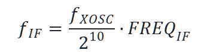


</div>
<br>

One thing to be aware of is a common variable found in many of the equations in the CC1101 data sheet, which is *f<sub>xosc</sub>*. This variable is referring to the frequency at which the [crystal oscillator](https://www.epsondevice.com/crystal/en/techinfo/column/crystal-oscillator/osc.html) vibrates. According to **Section 4.4** of the data sheet, this value is between 26-27 MHz:

<div align="center">

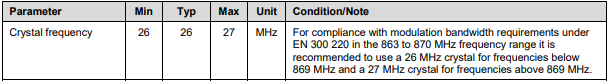

</div>

---

The main equation of importance to calculate our carrier frequency is the one below:

<div align="center">

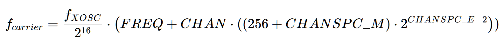

</div>
<br>

Where *f<sub>carrier</sub>* is the desired transmit signal (such as 315 MHz), *f<sub>xosc</sub>* is the frequency at which the crystal oscillator vibrates (26 MHz), and *FREQ* is the value we need to program into the frequency registers discussed above. The other variables regarding channels such as *CHAN* and *CHANSPC_M* can be set to zero to simplify the equation (since we are not using any channel functionality on the CC1101). The resulting simplified equation is:

<div align="center">


</div>
<br>

Assuming we want to transmit a signal at 315 MHz, we can substitute the values like so:

<div align="center">


</div>
<br>

And rearrange the equation to solve for the frequency:

<div align="center">


</div>
<br>

The result is *FREQ* ≈ `793,994`.

The hard part of calculating the frequency is complete. Now all we have to do is store the value of *FREQ* across the three registers `FREQ2`, `FREQ1`, and `FREQ0`. `793,994` in hexadecimal is `0x0C1D8A`. The reason we use three registers instead of one is, of course, the *FREQ* value is too large to store in a 1-byte register. We will send `0x0C` to `FREQ2`, `0x1D` to `FREQ1`, and `0x8A` to `FREQ0`. The frequency registers are shown below.

<br>
<div align="center">


Page 75: Frequency Registers

</div>

>Note: The upper two bits of `FREQ2` are always set to 0 (not used). This is because the CC1101 is a sub-1 GHz transceiver. If we could hypothetically use all 24 bits and substitute that value into the carrier frequency equation, it might push the calculated frequency into the GHz range. This would be beyond the hardware capabilities of the CC1101.

### Setting the Frequency in C++
Most of the coding examples will be shown in the [Sending Data in C++](#7-sending-data-in-c) section of this guide. As a quick reference, we walk through setting the frequency before we move on to the next section of the guide.

We will use the value we calculated earlier, FREQ ≈ `793,994`, that corresponds to setting the frequency to 315 MHz. Remember that communication with the CC1101 starts with a header byte [following a specific format](https://github.com/ryan2625/ESP32-CC1101?tab=readme-ov-file#expected-transaction-format) outlined in my first guide.

We must do the following to set the frequency:

- Construct the header byte.
    - Set bit position 7 of the byte to `0` to use write mode.
    - Set bit position 6 to `1` to denote burst access. This will let us write to all three frequency registers in one transaction.
    - Set bit positions 5–0 to `001101` for the FREQ2 register address. Since the address field is 6 bits wide, the original value of `1101` (`0x0D`) is padded with leading zeros.
    - The entire header byte is `01001101`, or `0x4D`.
- Convert `793,994` to hex which is `0x0C1D8A`, and split this into three bytes; one for each register.
- Send the header byte, followed by the three bytes representing the FREQ value.

>Note: When setting the burst bit to `1` in write mode, data is written sequentially to consecutive registers with increasing address values. This means we only need to specify the address of the first register for burst access. Refer to the register addresses listed below. The [entire address list](#spi_space) is visualized later in the guide. <div align="center">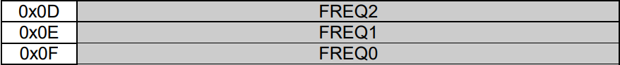</div> 

<br>

```cpp
...
extern "C" void app_main(void) {
    ...
    // The order that the registers will be written to is:
    // FREQ2 -> FREQ1 -> FREQ0
    // 0x0C goes to FREQ2, 0x1D to FREQ1, and 0x8A to FREQ0

    spi_transaction(
        cc1101, // Device handle
        (uint8_t[]){0x4D, 0x0C, 0x1D, 0x8A}, // Bytes to transmit
        4, // How many bytes we are transmitting
        "FREQ" // Name of operation
    );
}
```
Where [`spi_transaction`](https://github.com/ryan2625/CC1101-TX/blob/main/src/main.cpp) is a helper function defined in `main.cpp`. 


# 3. Modulation Format
## **Section 16: Modulation Formats** Overview
The CC1101 supports amplitude, frequency, and phase modulation formats. For this guide, we will be focusing on a type of frequency modulation known as [2-FSK](https://en.wikipedia.org/wiki/Frequency-shift_keying) (binary frequency shift keying). An example of how 2-FSK works in practice can be found in the [Carrier Frequency](#carrier-frequency) section. 

The register that stores the modulation format is named `MDMCFG2`. There is a table inside this register that shows we would need to send a value of `000` to the `MOD_FORMAT` field to specify 2-FSK as our format. The default value for this field is conveniently set to `000` already, so we technically don't need to worry about this register right now.

<div align="center">

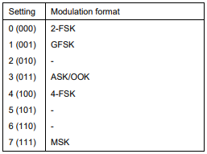

Page 77: Setting Table for the `MDMCFG2.MOD_FORMAT` Field at Address `0x12`

</div>

## Scientific Notation
2-FSK works by periodically shifting the frequency by amount called the 'deviation.' The CC1101 uses two things to derive the value of the deviation: the mantissa and the exponent. 

The mantissa allows for fine adjustment of the deviation, while the exponent scales the deviation value quickly. These concepts are also used in [Scientific Notation](https://en.wikipedia.org/wiki/Scientific_notation). The mantissa and exponent values are configured in the `DEVIATN.DEVIATION_M` and `DEVIATN.DEVIATION_E` fields respectively at address `0x15`. 

> [!NOTE]
> For example, 300 written in scientific notation is 3 * 10<sup>2</sup>. 3 is the mantissa, and 2 is the exponent. We can see that changing the value of the exponent will cause a more drastic change in the result of this equation than changing the mantissa.

<div align="center">

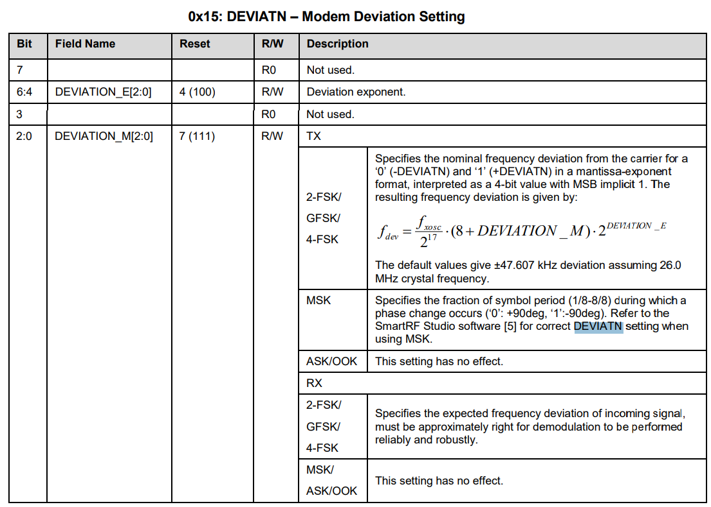

Page 79: `DEVIATN` Register

</div>

## Calculating the Frequency Deviation

As mentioned before, we are implementing 2-FSK modulation which requires a value for the deviation. The deviation is given by the following equation:

<div align="center">


</div>

Where *f<sub>xosc</sub>* is the frequency of the crystal oscillator, *DEVIATION_M* is the mantissa, and *DEVIATION_E* is the exponent. The configuration software outlined in **Section 9** of the datasheet can be used to generate mantissa and exponent values based off of a target deviation. Since we are solving the equation manually, we will instead have to examine how different mantissa and exponent values affect the resulting frequency deviation. 

In practice, the frequency deviation and data rate values should be chosen together. To simplify this guide, we will instead pick a generally safe deviation of approximately 25 kHz. Relating the data rate to the frequency is called the *modulation index*. Further reading on 2-FSK is recommended if you want to optimize your values.

Since the `DEVIATN` register uses 3 bits for the exponent and 3 bits for the mantissa, each field can hold a value from `000` to `111`. This means there are 8 different valid values for each part, leading to a total of 64 possible combinations between them. 

I experimented with a few different values trying to get as close as possible to 25 kHz, and the best combination I came up with was *DEVIATION_M* = 0 and *DEVIATION3_E* = 4. This gives us the equation:

<div align="center">

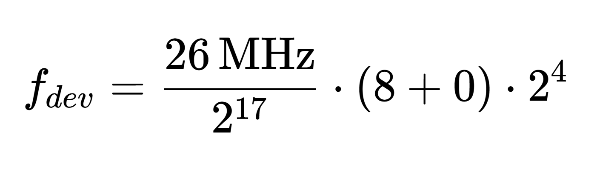


</div>
<br>

Solving this results in *f<sub>dev</sub>* = **25.4 kHz**. Looking at the [`DEVIATN`](https://github.com/ryan2625/CC1101-TX/blob/main/Assets/DEVIATN.png) register, we can see that bit 7 and bit 3 are unused, while bits 6-4 store the exponent and bits 2-0 store the mantissa. Substituting our exponent value of 4 and the mantissa value of 0, we end up with the binary number `0100 0000`. Converting this value to hexadecimal gives us `0x40`, which we will send to the register. 

# 4. Bit Timing and Data Rate
## **Section 12: Data Rate Programming** Overview
The data rate of the radio determines how fast data is transmitted or received. Similar to how we stored the deviation for 2-FSK modulation, we will store the mantissa and exponent calculated from the data rate equation into registers instead of the literal data rate value. 

The CC1101 will use these values to derive the data rate in baud (which is a unit of transmission speed). The relevant fields for this section are the `MDMCFG3.DRATE_M` and `MDMCFG4.DRATE_E` fields.

As stated previously, the data rate and frequency deviation should be related to one another through a modulation index. For this guide, we will instead simply use a safe baud rate of 25 kBaud. 

>Note: Having a data rate of 25 kBaud  means we are transmitting 25,000 symbols per second, where a symbol is defined as the radio frequency state that represents the data. The only important part to understand about symbols now is that for 2-FSK, 25,000 symbols per second = 25,000 bits per second.

<div align="center">

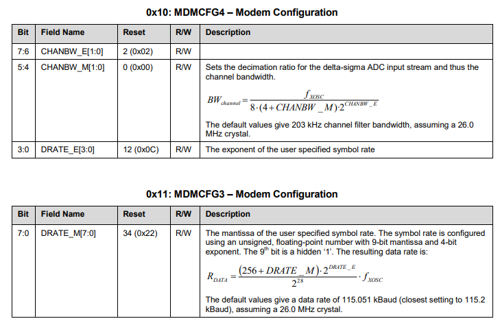

Page 76: Data Rate Registers
</div>

## Calculating the Data Rate
There are a few important equations to consider when calculating the data rate. The variables in these equations are the data rate (*R<sub>DATA</sub>*), data rate mantissa (*DRATE_M*), data rate exponent (*DRATE_E*), and the crystal oscillator frequency (*f<sub>xosc</sub>*). The data rate formula the CC1101 uses internally is given below:

<div align="center">

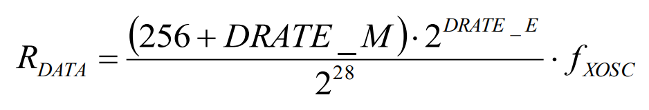

</div>
<br>

To find out the values of *DRATE_E* and *DRATE_M*, we must look at two other equations. The first of the two relates the data rate exponent to the crystal oscillator frequency and the data rate:

<div align="center">


</div>
<br>

The second relates the data rate mantissa to the data rate, crystal oscillator frequency, and data rate exponent:

<div align="center">


</div>
<br>


To determine these values, we first solve for *DRATE_E*, since its equation relates the target data rate to the crystal oscillator frequency. We know both of these values, as we decided earlier we want to target a data rate of 25 kBaud and our crystal oscillator's frequency is 26 MHz. With that said, our equation now becomes:

<div align="center">

<p></p>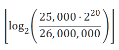

</div>
<br>

Solving this equation gives us *DRATE_E* = 9.

We now have all the appropriate values to substitute into the equation above that calculates the value of *DRATE_M*. Solving that equation gives us *DRATE_M* ​≈ 248.12. We will round this to the nearest integer which will be 248, as the register for the mantissa is only 8 bits. This means it can only store integers between 0-255, no decimals.

Since the data rate mantissa is the only field contained within the [`MDMCFG3`](https://github.com/ryan2625/ESP32-CC1101-Transmission/blob/main/Assets/MDMCFG.png) register, we do not have to worry about preserving any other bits. We will send our value of 248 here in hexadecimal which works out to be `0xF8`. 

We will store *DRATE_E* = 9 in the [`MDMCFG4`](https://github.com/ryan2625/CC1101-TX/blob/main/Assets/MDMCFG.png) register, which also contains the fields used to configure channel bandwidth. It is good practice to preserve the default values in these registers if we don't need to modify them. Therefore, we will send the bits `10` for `CHANBW_E`, `00` for `CHANBW_M`, and `1001` for `DRATE_E`. We end up with `10001001` = `0x89`. 

<div align='center'>

| Register Name | Register Address | Updated Register Value |
|---------------|------------------|----------------|
| `MDMCFG4` | `0x10` | `0x89` |
| `MDMCFG3` | `0x11` | `0xF8` |

</div>

# 5. Transmit Power
## **Section 24: Output Power Programming** Overview
The output power determines how strong the transmitted radio signal will be. The CC1101 stores up to 8 power amplifier settings in a special register called `PATABLE`. We will only be using one setting, so we can ignore the parts about the `FREND0.PA_POWER` field in the datasheet which would control selecting different power levels. We are going to program the first entry `PATABLE`[0], which is the default power setting used by the radio.

Below is a table showing what power output corresponds to what setting value. These settings vary depending on the frequency band being used, where a frequency band is simply a range of frequencies on the electromagnetic spectrum. We are going to look at the 315 MHz band column, as we want to transmit a 315 MHz signal for this project. 

<div align='center'>


</div>

>Note: There are tables for multi-layer inductors and wire-wound inductors in **Section 24**. The power output doesn't have to be a specific value for this project's goal, but just be aware that the power settings can change depending on what type of CC1101 module you have.

## Setting the Output Power
The `PATABLE` register is located at address `0x3E`. Since we are only setting a single power output, we will just be sending one byte to this address. Based on table 39, `0x51` provides a reasonable midrange transmit power for the 315 MHz band; we will send this value to the register. **Section 10.6** provides more information on how to access the `PATABLE` register.
 
# 6. Transmitting Packets

## Packet Structure
This guide uses the CC1101 packet handler (TX FIFO packet mode) to transmit data, not synchronous/asynchronous serial direct modes. For this mode, the packet structure in the CC1101 follows a particular pattern that is outlined in **Section 15** of the datasheet. 

In the figure below, we can see designated bits for things such as Preamble bits, the Sync Word, and the data field. This section of the guide will explain the anatomy of a packet and how to configure its different parts.

<div align='center'>

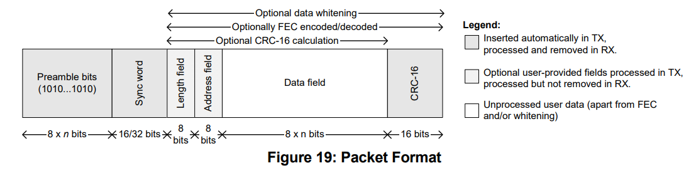

</div>

### Preamble Bits
Preamble bits (or bytes) are a sequence of alternating bits sent at the start of a transmission that serve multiple purposes. The first is that they denote the beginning of a packet, letting the receiver know a transmission is starting. 

The second purpose is that they assist in synchronizing the transmission timing between the receiver and the transmitter to ensure data is processed correctly. The overall purpose of the preamble bits is to help tune the receiver before meaningful data is sent.

In the CC1101, the amount of preamble bytes sent is configured in the `MDMCFG1.NUM_PREAMBLE` field at `0x13`. The datasheet recommends using a 4-byte preamble (32 bits) which corresponds to setting 2 of the field. When the radio enters `TX` mode, it will keep transmitting the preamble bytes you configured infinitely until a byte is written to the TX FIFO. 

<div align='center'>


Page 77: `MDMCFG1` Register

</div>


### Synchronization Word
The Synchronization (sync) word's primary purpose is to mark the exact start of valid data in a signal. It can also help with network filtering, where a receiver can check the sync word of a signal and ignore signals that do not match the expected sync word. 

More information on the sync word can be found in **Section 14.3: Byte Synchronization**. The sync word value itself is arbitrary, but the receiver and the transmitter must match each other if it is used.

The CC1101 recommends implementing a 4-byte sync word, stored in the `SYNC1` at `0x04` and `SYNC0` at `0x05` registers. To reach the recommended 4 bytes in a sync word, we will have to send the `MDMCFG2.SYNC_MODE` field either a 3 (`011`) or a 7 (`111`). This will duplicate the 2 bytes we have stored in `SYNC1` and `SYNC0` and send 4 bytes in total when we transmit data. 

<div align='center'>

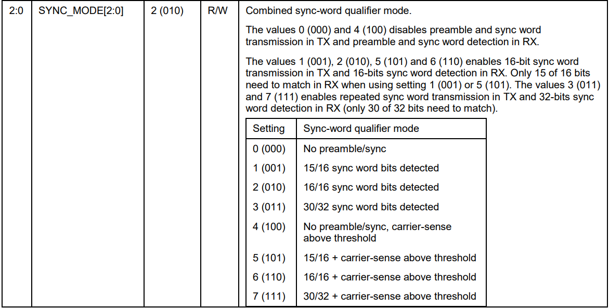

Page 77: `MDMCFG2.SYNC_MODE` Field

</div>

>Note: If you have a sync word, you must always include preamble bits and vice versa. Both of these will be automatically inserted at the start of a transmission in setting 3 or 7. We will not have to manually send them after configuration.

### Packet Length
The CC1101 expects a packet length mode to be configured in the `PKTCTRL0.LENGTH_CONFIG` field at `0x08`. There are three different modes for packet length...
1. Fixed packet length mode: the packet length is predefined and must be the same for every transmission. This length (in bytes) must be configured separately in the `PKTLEN` register at `0x06`. This is the mode we will be using in our implementation later on.
2. Variable packet length mode: the length of the packet is set by the first byte written to the TX FIFO instead of the `PKTLEN` register. Sequentially, this byte appears after the sync word.
3. Infinite packet length mode: there is no set length of the packet, and the CC1101 will continually transmit data it is given. 

Packet length settings do not include preamble bits or the sync word in the byte count.

>Note: The maximum packet length for fixed and variable packet length modes is 255 bytes. Use infinite packet length mode for payloads longer than 255. When working with packets longer than 64 bytes, consider **Section 15.6: Packet Handling in Firmware**.

<div align='center'>

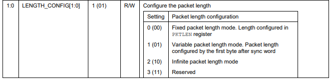

Page 78: `PKTCTRL0.LENGTH_CONFIG` Field

</div>

### Other Packet Features
There are a few other optional packet features that we will not be implementing in this guide. These include:
- Data Whitening, which alters the bit pattern of transmitted data to help receivers decode it more effectively.
- Forward Error Correction and Interleaving, which helps receivers handle errors and makes the signal more robust.
- CRC ([Cyclic Redundancy Check](https://en.wikipedia.org/wiki/Cyclic_redundancy_check)) Checksum, an error detection method that will let the receiver know if the packet is corrupted.
- The Address Byte, which is a byte dedicated towards address filtering. Similar to the sync word, this enables receivers to ignore irrelevant traffic and only look at signals with a specific address byte.


## Transmission Mechanics and the Data FIFO 

### `TX` Radio State
As seen earlier in the [simplified radio control diagram](https://github.com/ryan2625/CC1101-TX/blob/main/Assets/simplified_state_diagram.png), the radio has a set number of states it can exist in. Each state can only be entered through specific transitions, including the state for transmit (`TX`) mode.

Every time the radio starts up, it should be [reset with the `SRES` strobe](https://github.com/ryan2625/ESP32-CC1101?tab=readme-ov-file#cc1101-initialization-procedure) and put into IDLE mode. To transmit data, we have to go from the `IDLE` state to the `TX` state. Luckily, we can reach this mode with a single command strobe called `STX` located at address `0x35`.

There is one more aspect of the radio state that should be considered before transmitting a signal: calibrating the [frequency synthesizer](https://en.wikipedia.org/wiki/Frequency_synthesizer). We can enable automatic calibration when entering `TX` mode with the [`MCSM0.FS_AUTOCAL`](Assets/MCSM0.png) field at `0x18` by sending the byte `0x14`. This will preserve the defaults while only changing the value of `FS_AUTOCAL`.

Shown below is the status register `MARCSTATE` that will contain the current state the radio is in, which is useful for debugging purposes.

<div align='center'>


Page 93: `MARCSTATE` Register

</div>

>Note: Both the STX command strobe and the MARCSTATE register are located at address `0x35`. The difference is that when we communicate with the CC1101 using the SPI interface, we are changing the burst and R/W bit values to [distinguish between a status register and a command strobe](https://github.com/ryan2625/ESP32-CC1101?tab=readme-ov-file#address-overloading) at the same address. Remember that an SPI transaction starts with a header byte that contains a R/W bit, a burst bit, and a 6-bit address.<br><br> Setting the burst and R/W bit to 1 changes the header byte from `0x35` to `0xF5`. Sending `0x35` activates the STX strobe, while sending `0xF5` returns the MARCSTATE register value. Refer back to the section regarding [expected transaction format](https://github.com/ryan2625/ESP32-CC1101?tab=readme-ov-file#expected-transaction-format) from my first guide. 

---
### Writing to the TX FIFO
The CC1101 contains two data FIFOs, one for transmitting data (the TX FIFO) and one for receiving data (the RX FIFO).

The TX/RX FIFOs are accessed through the address `0x3F`. This area does not refer to a register, but rather to a [data buffer](https://en.wikipedia.org/wiki/Data_buffer). The TX FIFO is implemented as a 64-byte queue that sends data in the exact order it is fed; as data is transmitted, it leaves the buffer.

Below are the possible FIFO access [header bytes](https://github.com/ryan2625/ESP32-CC1101?tab=readme-ov-file#expected-transaction-format) from **Section 10.5** and their respective functionalities. A R/W bit set to `0` corresponds to TX FIFO access, while a `1` corresponds to RX FIFO access.

- 0x3F: Single byte access to TX FIFO
- 0x7F: Burst access to TX FIFO
- 0xBF: Single byte access to RX FIFO
- 0xFF: Burst access to RX FIFO

For example, after sending the byte `0x7F`, every subsequent byte sent in the same SPI transaction will be written into the TX FIFO.

### Transmission Flow
Assuming there is data in the TX FIFO and preamble/sync word insertion is enabled in `MDMCFG2.SYNC_MODE`, let's look at the order of how CC1101 transmits data once it enters `TX` mode. Ignoring the optional packet features, the radio does the following:
1. Automatically sends the programmed number of preamble bytes specified in the `MDMCFG1.NUM_PREAMBLE` field
2. Attaches the sync word to the payload from `SYNC1` and `SYNC0`
3. Sends the data in the TX FIFO

During this flow, the radio can enter any of the scenarios outlined in the next section.
> Note: **Section 15.4** of the datasheet outlines the transmission flow.

### TX Mode Scenarios
There are three different scenarios in `TX` mode that can occur either when writing to the TX FIFO or when a transmission finishes. These three scenarios are: 
1. The radio moves into the next state determined by the `MCSM1.TXOFF_MODE` field
2. The radio enters the `TXFIFO_UNDERFLOW` state
3. TX FIFO Overflow occurs

The first scenario is activated when a transmission is completed without any errors. In this case, the `MCSM1.TXOFF_MODE` field at address `0x17` will automatically put the radio into one of four states.
<div align='center'>

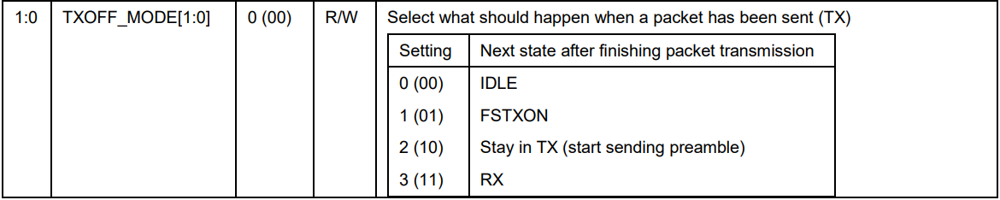
 
Page 81: `MCSM1.TXOFF_MODE` Field

</div>
<br>

The second scenario is entering the `TXFIFO_UNDERFLOW` state. This state occurs when the TX FIFO becomes empty in the middle of transmitting a packet. This error primarily happens when we specify a packet length, but the TX FIFO has less bytes than the number we configured. 
> For example, if we are in static packet length mode and send the `PKTLEN` register the value `0x0A`, this will make our expected packet length 10 bytes. If we only fill our TX FIFO with 5 bytes and enter 'TX' mode, we will run out of bytes to send. In this scenario, the radio will enter the error state `TXFIFO_UNDERFLOW`.


The third scenario, TX FIFO Overflow, occurs when we fill the TX FIFO with more than 64 bytes of data. In this scenario, there isn't a specific state the radio enters like there is for underflow. Instead, the data in the FIFO might become corrupted and the radio may behave unpredictably. 

> [!IMPORTANT]
> Suppose we set our packet length as 10 but fill the TX FIFO with 20 bytes. Upon completing a transmission, we may end up having leftover bytes sitting in the FIFO. This is not considered TX FIFO Overflow. Those bytes just remain there until they are emptied or sent in the next transmission.

---

#### Error Recovery
We must put the radio in a known safe state after we encounter an error. A common safe state to enter is the `IDLE` state. This helps the radio reset itself to a predictable baseline, which is why we immediately enter this state when we power on the device. 

The command strobe to send for error recovery in `TX` mode is `SFTX` at address `0x3B`. This will empty (flush) the TX FIFO and put the device in the `IDLE` state. 

We can see what state the radio is in from either the `MARCSTATE` register or the chip status byte explained in **Section 10.1**. As seen in the image below, the chip status byte `STATE` field holds the state the radio is in, while the `FIFO_BYTES_AVAILABLE` field contains the number of bytes that can be written to the TX FIFO.

The meaning of this field changes if we are reading a register instead of writing to one.
<div align='center'>

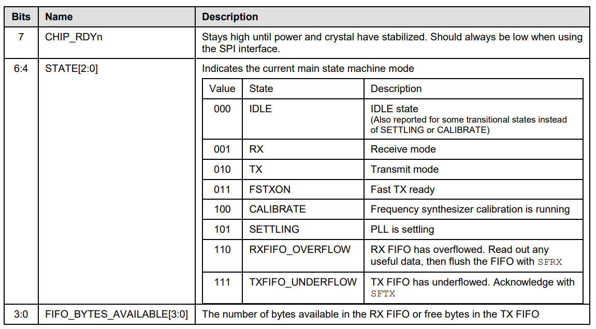

Page 31: Chip Status Byte Format
</div>

The maximum value of `FIFO_BYTES_AVAILABLE` is 15, or `1111`. When `FIFO_BYTES_AVAILABLE` = 15, 15 or more bytes are available/free. To get the exact number of bytes in the TX FIFO, check the `TXBYTES` status register at address `0x3A`. The header byte you should send to access this register is `0xFA` (`0x3A` with the read and burst bits set).

>Note: Recall that the  chip status byte is always the first byte received back from the CC1101 in an SPI transaction.
## TX FIFO Threshold
As stated earlier, the TX FIFO is a 64-byte buffer that holds the data you will transmit. Causing overflow or underflow in this buffer can cause error states and lead to unpredictable radio behavior. In addition to the chip status byte, there is another optional mechanism to assist us with managing the TX FIFO called the FIFO threshold.

In `TX` mode, the FIFO threshold is essentially a way to warn us when the number of bytes in the TX FIFO crosses a certain level. We can set the threshold by sending a value to the `FIFOTHR.FIFO_THR` register field at `0x03`. Keep in mind this threshold is simply a warning, and does not prevent underflow on its own.

For example, if we send the value `1110` to the register, we will get a warning when there is only 5 bytes left in the TX FIFO. The mapping of values to thresholds is seen below.

<div align='center'>

`FIFO_THR` Value | TX FIFO byte threshold | 
|---------------|--------------|
| `0000` | 61 |
| `0001` | 57 |
| `0010` | 53 | 
| `0011` | 49 | 
| `0100` | 45 | 
| `0101` | 41 | 
| `0110` | 37 | 
| `0111` | 33 | 
| `1000` | 29 | 
| `1001` | 25 | 
| `1010` | 21 | 
| `1011` | 17 | 
| `1100` | 13 | 
| `1101` | 9  | 
| `1110` | 5  |
| `1111` | 1  | 

Page 56: FIFO Thresholds for `TX` Mode

</div>

<br>

The way we read this warning is different than how we read other data from the CC1101. The typical way we communicate with the CC1101 is through the [SPI interface](https://www.analog.com/en/resources/analog-dialogue/articles/introduction-to-spi-interface.html), where we send data from our ESP32 to the CC1101 through the `MOSI` pin and receive data from the CC1101 to our ESP32 with the `MISO` pin. For detecting the threshold warning, we instead use the `GDO0` (general digital output) pin.

Reading the threshold is just a single use for the `GDO0` pin. It can also let you know when the crystal oscillator is stable, when the chip enters the `CHIP RDYn` state, and much more. The `GDO0` pin is configured in the `IOCFG0.GDO0_CFG` field at address `0x02`. To set the `GDO0` pin to warn us of the threshold, we coincidentally send the value `0x02` to this field.
<div align='center'>

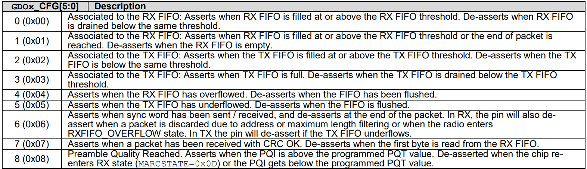
 
Page 62: The First 8 Configurations in the `GDO_CFG` Field
</div>

<br>

The `GDO0` pin exists in a binary state of either being pulled high or low (we will read it as a `1` or a `0`). It doesn't stream data like the [`MOSI`/`MISO` pins](https://github.com/ryan2625/ESP32-CC1101?tab=readme-ov-file#3-initialize-an-spi-bus). All it can do is act as a signal that answers yes or no to questions such as:
- Have we passed our TX FIFO threshold?
- Is the crystal oscillator stable?
- Has the TX FIFO underflowed?

Below is a representation of how the `GDO0` pin acts when we set the transmit buffer to a certain value. We can see from the caption that the TX FIFO threshold is at setting 13 (`1101`), which corresponds to a threshold of 9 bytes. In `TX` mode, the pin goes high once we reach or surpass threshold, and is pulled low again when we drop below it.

<div align='center'>

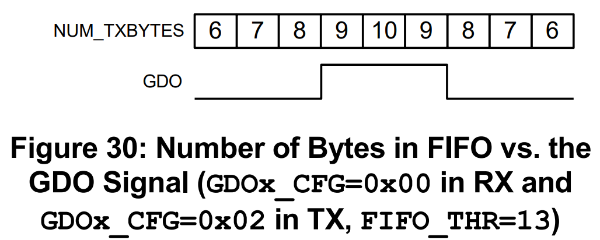
 
Page 56: FIFO Thresholds

</div> 

### Accessing the `GDO0` Pin
Every GPIO pin must be configured before it can be used. So before we read the `GDO0` pin level, we must configure the pin with the [`gpio_set_direction`](https://docs.espressif.com/projects/esp-idf/en/stable/esp32/api-reference/peripherals/gpio.html#_CPPv418gpio_set_direction10gpio_num_t11gpio_mode_t) method from the ESP-IDF API. This method has two parameters:
- `gpio_num`: Which GPIO pin you are configuring. In our case, it will be the ESP32 pin `GDO0` is connected to.
- `mode`: Sets if we can send or receive data on this pin. 


We can read the `GDO0` pin state with the [`gpio_get_level`](https://docs.espressif.com/projects/esp-idf/en/stable/esp32/api-reference/peripherals/gpio.html#_CPPv414gpio_get_level10gpio_num_t) method. This method has one parameter:

- `gpio_num`: The GPIO pin you want to read the level of (high or low)

Assuming we configured the `GDO0` pin in `IOCFG0.GDO0_CFG` to signal the TX FIFO threshold, the pin will return 1 when above the threshold and 0 when below it.

```cpp
#include "driver/gpio.h"
#include "driver/spi_master.h"
#include "freertos/FreeRTOS.h"

extern "C" void app_main(void) {
    ...
    // The mode that designates a pin
    // as read-only is GPIO_MODE_INPUT
    gpio_set_direction(GPIO_NUM_4, GPIO_MODE_INPUT); 
    ...
    gpio_get_level(GPIO_NUM_4); // Returns 1 or 0
    ...
}
```

> [!TIP]
> Below is a reminder of the CC1101 pinout.
> <div align='center'>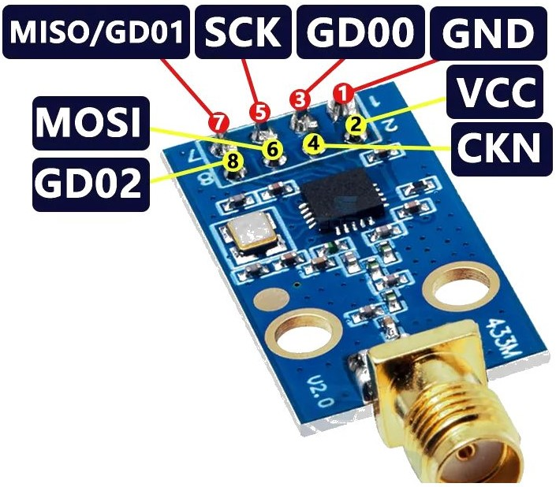
>
></div> 


# 7. Sending Data in C++
## Configuring the SPI Bus
To transmit a signal, the first thing our program must do is configure the SPI bus. Configuring the SPI bus takes the two methods [`spi_bus_initialize`](https://github.com/ryan2625/ESP32-CC1101?tab=readme-ov-file#method-spi_bus_initialize) and [`spi_bus_add_device`](https://github.com/ryan2625/ESP32-CC1101?tab=readme-ov-file#method-spi_bus_add_device) from the ESP-IDF API documentation. These methods were reviewed in depth in my first guide, so please refer back to those explanations if you want to know more. 
## Helper functions

### `spi_transaction`

There are two important helper functions inside `main.cpp` that make accessing registers easier. The first function, `spi_transaction`, simplifies SPI transactions. To perform a transaction with this function, we simply pass in the device handle, an array of bytes to send, and the length of that array. This function is similar to the `transmit_data` function from the first guide.

```cpp
void spi_transaction(spi_device_handle_t cc1101, const uint8_t* data, size_t len) {
    spi_transaction_t t = {};
    uint8_t rx[len];
    t.tx_buffer = data;
    t.rx_buffer = rx;
    t.length = len * 8;
    ESP_ERROR_CHECK(spi_device_polling_transmit(cc1101, &t));
}
```
### Notes

- The `tx_buffer` is filled with the data we send, and the `rx_buffer` is filled with the response from the CC1101 which we can read off after the transaction.
- [`spi_device_polling_transmit`](https://docs.espressif.com/projects/esp-idf/en/stable/esp32/api-reference/peripherals/spi_master.html#_CPPv427spi_device_polling_transmit19spi_device_handle_tP17spi_transaction_t) is the function from the ESP-IDF API that performs the actual SPI transaction.
- `rx_buffer[0]` will always be the chip status byte.
- `tx_buffer[0]` will always be the header byte.

### `calculate_header_byte`
The second function `calculate_header_byte` helps us calculate the header byte based off of how we want to interact with a register.

As previously mentioned, the [header byte](https://github.com/ryan2625/ESP32-CC1101?tab=readme-ov-file#expected-transaction-format) in an SPI transaction consists of a R/W bit, a burst bit, and a 6-bit address. If you are writing to a register without burst access (R/W bit = `0`, burst bit = `0`), the header byte will be the exact same as the register address.

If you are reading, using burst access, or both, the header byte changes by a fixed amount. We can use the [bitwise `OR` operator](https://www.geeksforgeeks.org/dsa/bitwise-or-operator-in-programming/) on the register value to construct the final header byte to send.

Let's look at one example to demonstrate how this function works. Suppose you want to write to the register `FREQ0`, which has the address `0x0F` (`1111` in binary). The steps are as follows:

### Pad the address to a full byte

```c
0000 1111
```

### Set the R/W bit (bit 7) and pad with 0's

For a read operation, the R/W bit is `1`, which corresponds to:

```c
1000 0000
```

### Use the bitwise OR operation on the two bytes

```c
0000 1111
1000 0000
---------
1000 1111
```

So, the final header byte we send becomes:

```c
0x8F
```

### Implementation

```cpp
uint8_t calculate_header_byte(uint8_t reg, bool read, bool burst) {
    return reg | (read ? 0x80 : 0x00) | (burst ? 0x40 : 0x00);
}
```


Where `|` is the C++ bitwise `OR` operator. This approach lets you store register addresses as constants and dynamically modify them depending on whether you are performing a read, write, or burst operation.

## Configuring Registers
Configuring the registers is a very repetitive task. See the section [Setting the Frequency in C++](#setting-the-frequency-in-c) for an example of what this looks like. One thing to note about configuring parameters in our program is that we are storing our register addresses in constants such as:

```cpp 
constexpr uint8_t CC1101_CONFIG_FREQ2 = 0x0D;
```

These constants are used to construct the final header byte with the `calculate_header_byte` function based on the burst and R/W bits. 

For registers that are accessed in burst mode, we only send the first register's address in the transaction. Burst mode automatically increments the register address during the transaction, so we don't need to explicitly define the subsequent registers. The following registers are used but not explicitly defined as constants:
- `FREQ1` and `FREQ0`, which come after `FREQ2`
- `SYNC0`, which comes after `SYNC1`

That is why you won't find a register address constant like `CC1101_CONFIG_SYNC0` in the code (as it is accessed automatically through burst mode), but you will find `CC1101_VALUE_SYNC0` because we still need to know what values to send to these addresses. 

>Note: Every single constant for register values defined in `main.cpp` has a comment explaining what their respective value means.

# 8. Running the Program
At this point, we have:
- Identified the registers required to transmit a signal
- Calculated the values required for a 315 MHz 2-FSK signal
- Learned the radio’s operating states and when to use command strobes
- Created helper functions in C++ to interact with the CC1101

The final step is to examine the program in [`main.cpp`](https://github.com/ryan2625/CC1101-TX/blob/main/src/main.cpp) and analyze its output. We will see the constants defined at the top, then the helper functions, and finally the `app_main` function.

It is encouraged to skim the program and connect the ideas we have discussed so far in the guide to the implementation. If our devices are connected properly, we get the following output when we run the program: 
```rust
I (297) main_task: Calling app_main()
I (1297) MAIN: Hello World...?
I (2297) CC1101: ========== ALL CONFIG VALUES ==========
I (2297) CC1101: Operation: READ AUTOCAL | 0x00 0x14
I (2297) CC1101: Operation: READ FREQUENCY | 0x00 0x0C 0x1D 0x8A 
I (2297) CC1101: Operation: READ MOD FORMAT / SYNC MODE | 0x00 0x03
I (2307) CC1101: Operation: READ DEVIATION | 0x00 0x40 
I (2307) CC1101: Operation: READ DATA RATE | 0x00 0x89 0xF8
I (2317) CC1101: Operation: READ POWER | 0x00 0x51 
I (2317) CC1101: Operation: READ SYNC WORD | 0x00 0xD3 0x91
I (2327) CC1101: Operation: READ PREAMBLE | 0x00 0x22
I (2327) CC1101: Operation: READ PKTCTRL0 | 0x00 0x00 
I (2337) CC1101: Operation: READ PKTLEN | 0x00 0x05
I (2337) CC1101: Operation: READ IOCFG0 | 0x00 0x02
I (2347) CC1101: Operation: READ FIFOTHR | 0x00 0x0E 
I (2347) CC1101: Operation: READ MCSM1 | 0x00 0x31
I (2347) CC1101: Operation: READ MARCSTATE | 0x00 0x01 
I (2357) CC1101: Operation: READ TXBYTES | 0x00 0x07
I (2357) CC1101: GDO0 level: 1
I (3367) CC1101: ============ AFTER 5 BYTES ============
I (3367) CC1101: Operation: READ MARCSTATE | 0x30 0x12
I (3367) CC1101: Operation: READ TXBYTES | 0x30 0x02 
I (3367) CC1101: GDO0 level: 0
I (4367) CC1101: ============ AFTER 10 BYTES ===========
I (4367) CC1101: Operation: READ MARCSTATE | 0x70 0x16
I (4367) CC1101: Operation: READ TXBYTES | 0x70 0x80 
I (4367) CC1101: GDO0 level: 0
I (4367) main_task: Returned from app_main()
```
---
The first part of the log is printed after loading 7 bytes into the TX FIFO and configuring all of our registers. As the log states, these are all of our configuration values. I've attached comments to some of the logs below regarding their value or function...
```rust
I (2297) CC1101: ========== ALL CONFIG VALUES ==========
I (2297) CC1101: Operation: READ AUTOCAL | 0x00 0x14
I (2297) CC1101: Operation: READ FREQUENCY | 0x00 0x0C 0x1D 0x8A 
I (2297) CC1101: Operation: READ MOD FORMAT / SYNC MODE | 0x00 0x03
I (2307) CC1101: Operation: READ DEVIATION | 0x00 0x40 
I (2307) CC1101: Operation: READ DATA RATE | 0x00 0x89 0xF8
I (2317) CC1101: Operation: READ POWER | 0x00 0x51 
I (2317) CC1101: Operation: READ SYNC WORD | 0x00 0xD3 0x91
I (2327) CC1101: Operation: READ PREAMBLE | 0x00 0x22
I (2327) CC1101: Operation: READ PKTCTRL0 | 0x00 0x00 

// 5 byte packet length
I (2337) CC1101: Operation: READ PKTLEN | 0x00 0x05
// Set GDO0 to give alerts about TX FIFO threshold
I (2337) CC1101: Operation: READ IOCFG0 | 0x00 0x02
// Our TXFIFO Threshold is 5 bytes
I (2347) CC1101: Operation: READ FIFOTHR | 0x00 0x0E 
// MCSM1 is the register for TXOFF_MODE. We set this field to 01, which essentially just means
// that the radio will send the strobe FSTXON after a transmission is complete. This is a state
// that performs some calibration steps that allows us to enter TX mode faster the next time
// we need to.
I (2347) CC1101: Operation: READ MCSM1 | 0x00 0x31
// This MARCSTATE value tells us the radio is in IDLE mode which is to be expected
I (2347) CC1101: Operation: READ MARCSTATE | 0x00 0x01 
// We have loaded up 7 bytes into our TX FIFO at this point
I (2357) CC1101: Operation: READ TXBYTES | 0x00 0x07
// Our GDO0 pin reads high, telling us we have more than 5 bytes in our TX FIFO
I (2357) CC1101: GDO0 level: 1
```

All of the values logged above correspond to the values we came up with in the previous sections of this guide.

---

The next part of the log is printed after we enter `TX` mode which will automatically start sending preamble bits, the sync word, and a 5-byte packet. Upon a successful transmission completion, we should see the [`TXOFF_MODE`](https://github.com/ryan2625/ESP32-CC1101-Transmission?tab=readme-ov-file#tx-mode-scenarios) register putting our radio into the `FSTXON` state.

```rust
I (3367) CC1101: ============ AFTER 5 BYTES ============
I (3367) CC1101: Operation: READ MARCSTATE | 0x30 0x12
I (3367) CC1101: Operation: READ TXBYTES | 0x30 0x02 
I (3367) CC1101: GDO0 level: 0
```
As expected, our `MARCSTATE` register lets us know we are currently in the `FSTXON` state (corresponding to `0x12`). We also see from the `TXBYTES` register that we have exactly 2 (`0x02`) bytes in our TX FIFO. 

Since we only have 2 bytes left in our TX FIFO and our threshold is 5, Our `GDO0` pin is now reading low.

---

The last thing we do is put our radio back into `TX` mode which will send another 5 bytes. 
```rust
I (4367) CC1101: ============ AFTER 10 BYTES ===========
I (4367) CC1101: Operation: READ MARCSTATE | 0x70 0x16
I (4367) CC1101: Operation: READ TXBYTES | 0x70 0x80 
I (4367) CC1101: GDO0 level: 0
```

Before attempting to send these 5 bytes, we only had 2 bytes in our TX FIFO. This means the radio will now enter the `TXFIFO_UNDERFLOW` state. We can confirm this since the chip status byte value is `0x70` and the `TXBYTES` register value is `0x80`.

## Proving the Transmission Was Successful
I've created a [simple program](https://github.com/ryan2625/CC1101-Receive-PoC) that can receive radio signals using the Arduino framework with the RadioLib library to verify that our transmission worked. In that code, I matched all of the parameters configured in `main.cpp`, including frequency, bitrate, and modulation format.

Using 2 ESP32s and 2 CC1101s, I set up a working demo. One pair was [flashed](https://en.wikipedia.org/wiki/Flash_memory) with the receiver code, and the other pair with the transmitter code.

The receiver logs the following data from the RX FIFO:
```cjs
[CC1101] Waiting for 5-byte packet...
[CC1101] Timeout
[CC1101] Waiting for 5-byte packet...
[CC1101] Packet received
Data:  D3 91 01 01 01
RSSI:  -58.50 dBm // Strength of signal
LQI:   0 // Signal integrity
[CC1101] Waiting for 5-byte packet...
[CC1101] Packet received
Data:  D3 91 01 01 DA  
RSSI:  -55.00 dBm
LQI:   26
```

The receiver code continuously polls the RX FIFO for incoming packets. Recall from `main.cpp`:
- The sync word was 32 bits (`0xD3` and `0x91` repeated)
- The Packet length was 5 bytes
- The TX FIFO was filled with 7 bytes of `0x01`
- We entered `TX` mode twice

The logs above generally reflect this scenario with a few issues. 

---
The first issue is that the sync word (`0xD3 0x91`) shows up in the RX FIFO. This is unexpected since the sync word is handled internally, and the RX FIFO should only capture bytes from the packet's data field. This issue was likely caused due to RadioLib defaulting to a 16-bit sync mode, while our transmitter used 32 bits. Consequently, the receiver started filling the buffer two bytes too early.

Because of that misalignment, the first packet appears truncated. The full 5 bytes of `0x01` were still transmitted, but not all were printed out in the log. That leaves only two valid bytes out of the original 7 for the second transmission, which is expected.

---
The second issue is the actual bytes logged in the second transmission. It contains the 5 bytes `D3 91 01 01 DA`. The first two are the sync word, the next two are the remaining data from the TX FIFO, and the last byte is mysterious. 

At first, I thought similar to how buffer underflow works in languages like C/CPP, the radio might have underflowed and grabbed the last value from the register in the address space below the TX FIFO, which would be `PATABLE`. 

This wouldn't make sense though, as there was no byte `DA` ever programmed into the `PATABLE` register. We will just have to dismiss this byte as random, nondeterministic noise sent when the TX FIFO underflowed.

> To send and receive signals at the same time, I had to create a high tech setup on my basement floor...
><div align="center">
>
></div>

# 9. Datasheet and Theory Abstraction in Libraries
Transmitting a CC1101 signal with just the ESP-IDF framework necessitates a deep understanding of the datasheet as well as far more manual setup. Accomplishing the same goal with a framework requires minimal effort and little understanding of the theory. 

One framework that can help us set everything up faster is the [Arduino platform](https://docs.platformio.org/en/latest/frameworks/arduino.html) that gives us access to all of the ESP32 APIs. This, combined with a library specifically designed to communicate with the CC1101 such as [RadioLib](https://github.com/jgromes/RadioLib) allows for the two devices to be used together without ever having to read the datasheet.

### SPI Configuration Steps

The Arduino platform turns the SPI configuration code from the ESP-IDF:
```cpp
    spi_bus_config_t busConfig = {};
    busConfig.mosi_io_num = GPIO_NUM_23;
    busConfig.miso_io_num = GPIO_NUM_19;
    busConfig.sclk_io_num = GPIO_NUM_18;
    busConfig.quadwp_io_num = -1; 
    busConfig.quadhd_io_num = -1;
    ESP_ERROR_CHECK(spi_bus_initialize(SPI3_HOST, &busConfig, SPI_DMA_DISABLED));

    spi_device_interface_config_t deviceConfig = {};
    spi_device_handle_t cc1101; 
    deviceConfig.command_bits = 0; 
    deviceConfig.address_bits = 0;
    deviceConfig.dummy_bits = 0;
    deviceConfig.mode = 0;
    deviceConfig.clock_speed_hz = 1000000; 
    deviceConfig.spics_io_num = GPIO_NUM_5; 
    deviceConfig.queue_size = 1; 
    ESP_ERROR_CHECK(spi_bus_add_device(SPI3_HOST, &deviceConfig, &cc1101));
```

Into roughly the equivalent:
```cpp
    SPIClass radioSPI(VSPI);
    radioSPI.begin(18,  19, 23, 5);
```
The code mapping of the two sections aren't exactly 1 to 1, but they essentially accomplish the same goal. 

- `SPIClass radioSPI(VSPI);` selects the SPI host to use

- `radioSPI.begin(18,  19, 23, 5);` configures the pin mapping

Setting up lower level SPI parameters such as clock speed and SPI mode are handled internally by the libraries, so they typically don't need to be explicitly set here.

### Register Configuration Steps

RadioLib turns the register values, configuration steps, and transmission steps from our original ESP-IDF code:
```cpp
constexpr uint8_t CC1101_STROBE_SRES      = 0x30;
constexpr uint8_t CC1101_STROBE_STX       = 0x35;
constexpr uint8_t CC1101_STROBE_SIDLE     = 0x36;
constexpr uint8_t CC1101_STROBE_SFTX      = 0x3B;
constexpr uint8_t CC1101_CONFIG_FREQ2     = 0x0D;
constexpr uint8_t CC1101_CONFIG_MDMCFG2   = 0x12; 
constexpr uint8_t CC1101_CONFIG_DEVIATN   = 0x15; 
constexpr uint8_t CC1101_CONFIG_MDMCFG4   = 0x10; 
constexpr uint8_t CC1101_CONFIG_MDMCFG3   = 0x11; 
constexpr uint8_t CC1101_CONFIG_PATABLE   = 0x3E;
constexpr uint8_t CC1101_CONFIG_SYNC1     = 0x04;
constexpr uint8_t CC1101_CONFIG_MDMCFG1   = 0x13; 
constexpr uint8_t CC1101_CONFIG_PKTCTRL0  = 0x08; 
constexpr uint8_t CC1101_CONFIG_PKTLEN    = 0x06;
constexpr uint8_t CC1101_CONFIG_IOCFG0    = 0x02; 
constexpr uint8_t CC1101_CONFIG_FIFOTHR   = 0x03; 
constexpr uint8_t CC1101_CONFIG_MCSM1     = 0x17; 
constexpr uint8_t CC1101_CONFIG_MCSM0     = 0x18;
constexpr uint8_t CC1101_STATUS_TXBYTES   = 0x3A;
constexpr uint8_t CC1101_STATUS_MARCSTATE = 0x35;
constexpr uint8_t CC1101_REG_FIFO         = 0x3F;
constexpr uint8_t CC1101_VALUE_FREQ2      = 0x0C; 
constexpr uint8_t CC1101_VALUE_FREQ1      = 0x1D; 
constexpr uint8_t CC1101_VALUE_FREQ0      = 0x8A; 
constexpr uint8_t CC1101_VALUE_MDMCFG2    = 0x03; 
constexpr uint8_t CC1101_VALUE_DEVIATN    = 0x40; 
constexpr uint8_t CC1101_VALUE_MDMCFG4    = 0x89; 
constexpr uint8_t CC1101_VALUE_MDMCFG3    = 0xF8; 
constexpr uint8_t CC1101_VALUE_PATABLE    = 0x51; 
constexpr uint8_t CC1101_VALUE_SYNC1      = 0xD3; 
constexpr uint8_t CC1101_VALUE_SYNC0      = 0x91; 
constexpr uint8_t CC1101_VALUE_MDMCFG1    = 0x22; 
constexpr uint8_t CC1101_VALUE_PKTCTRL0   = 0x00; 
constexpr uint8_t CC1101_VALUE_PKTLEN     = 0x05; 
constexpr uint8_t CC1101_VALUE_IOCFG0     = 0x02;
constexpr uint8_t CC1101_VALUE_FIFOTHR    = 0x0E;
constexpr uint8_t CC1101_VALUE_MCSM1      = 0x31; 
constexpr uint8_t CC1101_VALUE_MCSM0      = 0x14; 
constexpr uint8_t CC1101_DUMMY_BYTE       = 0x00;

uint8_t calculate_header_byte(uint8_t address, bool read, bool burst) {
    return address | (read ? 0x80 : 0x00) | (burst ? 0x40 : 0x00);
}

void spi_transaction(spi_device_handle_t cc1101, const uint8_t* data, size_t len,  const std::string& operation) {
    spi_transaction_t t = {};
    uint8_t rx[len];
    t.tx_buffer = data;
    t.rx_buffer = rx;
    t.length = len * 8;
    ESP_ERROR_CHECK(spi_device_polling_transmit(cc1101, &t));
};

void initialize_device(spi_device_handle_t cc1101) {
    spi_transaction(cc1101, (uint8_t[]){CC1101_STROBE_SRES}, 1, "SRES");
    spi_transaction(cc1101, (uint8_t[]){CC1101_STROBE_SIDLE}, 1, "SIDLE");
    spi_transaction(cc1101, (uint8_t[]){CC1101_STROBE_SFTX}, 1, "SFTX");
};

extern "C" void app_main(void)
{
    ...
    initialize_device(cc1101); 
    spi_transaction(cc1101, (uint8_t[]){calculate_header_byte(CC1101_CONFIG_MCSM0, false, false), CC1101_VALUE_MCSM0}, 2, "AUTOCAL");
    spi_transaction(cc1101, (uint8_t[]){calculate_header_byte(CC1101_CONFIG_FREQ2, false, true), CC1101_VALUE_FREQ2, CC1101_VALUE_FREQ1, CC1101_VALUE_FREQ0}, 4, "FREQUENCY");
    spi_transaction(cc1101, (uint8_t[]){calculate_header_byte(CC1101_CONFIG_MDMCFG2, false, false), CC1101_VALUE_MDMCFG2}, 2, "MOD FORMAT");
    spi_transaction(cc1101, (uint8_t[]){calculate_header_byte(CC1101_CONFIG_DEVIATN, false, false), CC1101_VALUE_DEVIATN}, 2, "MOD DEVIATION");
    spi_transaction(cc1101, (uint8_t[]){calculate_header_byte(CC1101_CONFIG_MDMCFG4, false, true), CC1101_VALUE_MDMCFG4, CC1101_VALUE_MDMCFG3}, 3, "DATA RATE");
    spi_transaction(cc1101, (uint8_t[]){calculate_header_byte(CC1101_CONFIG_PATABLE, false, false), CC1101_VALUE_PATABLE}, 2, "POWER");
    spi_transaction(cc1101, (uint8_t[]){calculate_header_byte(CC1101_CONFIG_SYNC1, false, true), CC1101_VALUE_SYNC1, CC1101_VALUE_SYNC0}, 3, "SYNC WORD");
    spi_transaction(cc1101, (uint8_t[]){calculate_header_byte(CC1101_CONFIG_MDMCFG1, false, false), CC1101_VALUE_MDMCFG1}, 2, "PREAMBLE");
    spi_transaction(cc1101, (uint8_t[]){calculate_header_byte(CC1101_CONFIG_MDMCFG2, false, false), CC1101_VALUE_MDMCFG2}, 2, "SYNC MODE");
    spi_transaction(cc1101, (uint8_t[]){calculate_header_byte(CC1101_CONFIG_PKTCTRL0, false, false), CC1101_VALUE_PKTCTRL0}, 2, "PKTCTRL0");
    spi_transaction(cc1101, (uint8_t[]){calculate_header_byte(CC1101_CONFIG_PKTLEN, false, false), CC1101_VALUE_PKTLEN}, 2, "PKTLEN");
    spi_transaction(cc1101, (uint8_t[]){calculate_header_byte(CC1101_CONFIG_MCSM1, false, false), CC1101_VALUE_MCSM1}, 2, "TXOFF MODE");
    spi_transaction(cc1101, (uint8_t[]){calculate_header_byte(CC1101_REG_FIFO, false, true), 0x01, 0x01, 0x01, 0x01, 0x01, 0x01, 0x01}, 8, "TX FIFO");
    spi_transaction(cc1101, (uint8_t[]){calculate_header_byte(CC1101_CONFIG_IOCFG0, false, false), CC1101_VALUE_IOCFG0}, 2, "GDO0 CONFIG");
    spi_transaction(cc1101, (uint8_t[]){calculate_header_byte(CC1101_CONFIG_FIFOTHR, false, false), CC1101_VALUE_FIFOTHR}, 2, "FIFO THR");
    spi_transaction(cc1101, (uint8_t[]){CC1101_STROBE_STX}, 1, "TX MODE");
    ...
}
```

Into just this:
```cpp
    CC1101 radio = new Module(5, 4, RADIOLIB_NC, RADIOLIB_NC, radioSPI);
    int state;
    state = radio.begin(315.0, 25.0, 25.0, 58.0, 0, 4);
    state = radio.setSyncWord(0xD3, 0x91);
    state = radio.fixedPacketLengthMode(5);
    state = radio.transmit((uint8_t[]){0x01, 0x01, 0x01, 0x01, 0x01}, 5);
```
A few of the values we explicitly set in our original program were redundant, as the CC1101 has certain default register values that were already aligned with our guide's goals. Even when considering that, our original code is still far larger than the relatively equivalent Arduino code. Not to mention all the time needed for navigating and understanding the datasheet.

This is the classic abstraction tradeoff... the ease and speed of development with libraries vs the customization and performance without them. Most hobbyist projects will benefit from using a library, unless a deeper understanding of the hardware is sought out.

---
This will be the end of this series on investigating the CC1101. If you would like to ask any questions or discuss embedded devices in general, feel free to reach out on [LinkedIn!](https://www.linkedin.com/in/ryan-freas/)
### Other Media
<a id='spi_space'></a>
<div align="center">


Table 45: Entire SPI Address Space
</div>

---
<br>
<a id='entire_radio'></a>
<div align="center">


Figure 25: Complete Radio Control State Diagram
</div>
